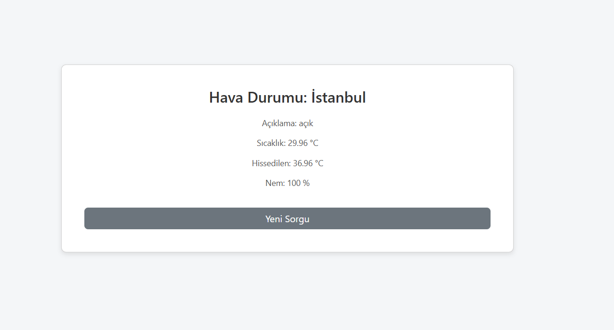

# Spring Weather App





Spring Boot ile geliştirilmiş basit ve modern bir hava durumu uygulamasıdır.  
Kullanıcılar şehir adı girerek, OpenWeatherMap API üzerinden sıcaklık, nem, hava durumu açıklaması ve hissedilen sıcaklık bilgilerini görebilir.

---

##  Özellikler

- Spring Boot tabanlı RESTful uygulama  
- Thymeleaf ile responsive ve sade arayüz  
- OpenWeatherMap API entegrasyonu  
- Hava durumu bilgileri:
  - Şehir adı
  - Sıcaklık (°C)
  - Hissedilen sıcaklık (°C)
  - Nem (%)
  - Hava açıklaması (Türkçe)   

---

##  Teknolojiler

- Java 17+  
- Spring Boot 3.x  
- Spring Web (MVC)  
- Thymeleaf  
- Maven  
- Bootstrap 5  
- OpenWeatherMap API  

---

##  API Key Kullanımı ve Uyarı

Bu proje OpenWeatherMap API kullanmaktadır.  
**Önemli:** API key gizli tutulmalı ve GitHub repository’sine push edilmemelidir.  

- Önceki API key güvenlik nedeniyle silinmiştir.  
- Projeyi çalıştırmak isteyen kullanıcılar kendi OpenWeatherMap hesabından **yeni bir API key** oluşturmalıdır:  
  [https://openweathermap.org/api](https://openweathermap.org/api)  

- Yeni key’i `src/main/resources/application.properties` dosyasına ekleyin:

```properties
openweathermap.api.key=YOUR_NEW_API_KEY
openweathermap.api.url=https://api.openweathermap.org/data/2.5/weather
